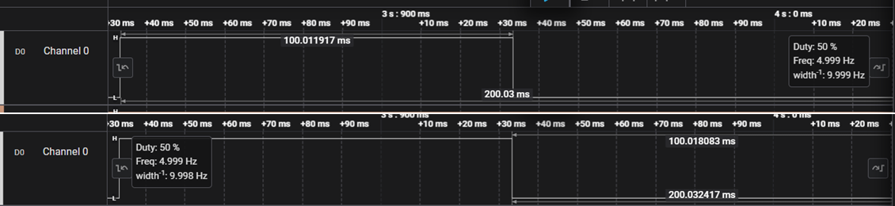

# TIM6 100ms Time Base

This project uses TIM6 as a basic timer on the NUCLEO-G071RB board to generate an update interrupt every 100 ms.

The TIM6 interrupt toggles the onboard LED pin PA5. The output was verified using a logic analyzer.

## Configuration

* Board: NUCLEO-G071RB
* MCU: STM32G071RB
* System clock: 64 MHz
* Timer: TIM6
* Timer mode: Basic timer
* TIM6 clock: 64 MHz
* Prescaler: 63999
* Period / ARR: 99
* Interrupt period: 100 ms

## Timer Calculation

The timer update period is calculated using:

```text
Update period = ((PSC + 1) * (ARR + 1)) / TIM6_CLK
```

For this project:

```text
Update period = ((63999 + 1) * (99 + 1)) / 64,000,000
              = 0.1 s
              = 100 ms
```

## Interrupt Flow

```text
TIM6 update event
    -> TIM6 interrupt
    -> TIM6_DAC_LPTIM1_IRQHandler()
    -> HAL_TIM_IRQHandler(&htim6)
    -> HAL_TIM_PeriodElapsedCallback()
    -> Toggle PA5
```

## Logic Analyzer Verification

The LED pin is toggled every 100 ms inside `HAL_TIM_PeriodElapsedCallback()`.

Since the pin changes state every 100 ms, the logic analyzer shows:

* High time: approximately 100 ms
* Low time: approximately 100 ms
* Full period: approximately 200 ms
* Frequency: approximately 5 Hz
* Duty cycle: approximately 50%


