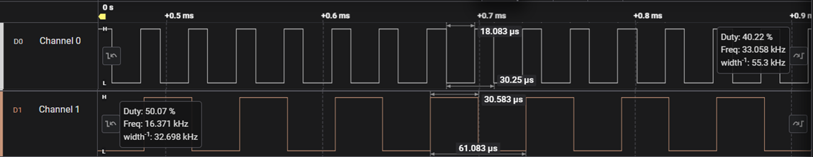
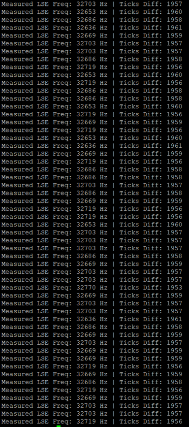
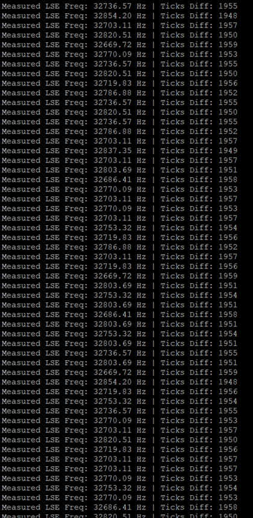

# Project 08: TIM2 Input Capture & LSE Measurement

This project demonstrates how to configure **Timer 2 (TIM2) in Input Capture Mode** on the STM32G071RB microcontroller to precisely measure the frequency of the **Low-Speed External (LSE)** crystal oscillator (32.768 kHz).

The system targets a high-performance configuration with the main system clock running at **64 MHz** via the PLL, outputting real-time capture statistics over UART2 to PuTTY.

---

## Project Objectives
* Configure **TIM2 Channel 1 (PA0)** as an Input Capture peripheral mapped directly to the LSE clock line.
* Capture consecutive rising edges to compute the delta between timer ticks (`Ticks Diff`).
* Verify the mathematical relationships between `SYSCLK`, `PCLK1`, and external low-speed signals.
* Retarget `printf` to **USART2 (PA2/PA3)** to output measurement data.

---

## Clock Configuration & Formulas

The microcontroller is driven by the **Internal High-Speed oscillator (HSI)** at 16 MHz, multiplied up to a **64 MHz SYSCLK** using the internal Phase-Locked Loop (PLL). 

Since Timer 2 runs directly on the `PCLK1` bus (undivided 64 MHz) with a prescaler value of `0`, the timer counter frequency is:

$$Timer2\_Freq = \frac{64,000,000\text{ Hz}}{0 + 1} = 64\text{ MHz}$$

The expected number of timer ticks during a single period of the LSE crystal ($32,768\text{ Hz}$) is derived via:

$$\text{Expected Ticks} = \frac{64,000,000\text{ Hz}}{32,768\text{ Hz}} = 1953.125\text{ ticks}$$

---

## Development Stages & Terminal Logs

### Stage 1: Hardware & Direct Logic Verification
Initially, the hardware captures were checked to confirm that the Callback interrupt (`HAL_TIM_IC_CaptureCallback`) safely captured consecutive pulse intervals.



---

### Stage 2: The Floating-Point `printf` Pitfall
When floating-point data was introduced to compute the raw frequency using a standard formatting string (`%lu` instead of float formatting, or enabling `%.2f` without library support), a known embedded library limitation caused memory alignment errors and broken print streams:



* **The Fix:** Instead of enabling heavyweight compiler flag parameters like `-u _printf_float` (which drains flash space), the `double` variable was split into two separate raw integer components representing the whole number and fractional values:
    ```c
    uint32_t freq_whole = (uint32_t)user_signal_freq;
    uint32_t freq_fraction = (uint32_t)((user_signal_freq - freq_whole) * 100);
    printf("Measured LSE Freq: %lu.%02lu Hz\r\n", freq_whole, freq_fraction);
    ```

---

### Stage 3: HSI Thermal Jitter Observations
Once data printed cleanly, the exact physics of an internal RC oscillator became evident. The system clock generated from the internal **HSI** was subject to small thermal fluctuations, causing the measured tick difference to fluctuate dynamically between **1948 and 1960 ticks**:



* **Key Engineering Takeaway:** While the capture math successfully hovered perfectly around the nominal $\sim32.7\text{ kHz}$ target, the jitter highlighted why internal RC oscillators are insufficient for highly accurate timekeeping compared to crystal-based High-Speed External (**HSE**) components.

---

## Source Architecture
* `Core/Src/main.c`: Hardware peripherals sequence loop, math logic calculations, and ISR retention blocks.
* `Core/Src/stm32g0xx_hal_msp.c`: Lower-level pin routing (PA0 AF2 for TIM2, PA2/PA3 for USART2) and clock gating definitions.
* `Core/Src/stm32g0xx_it.c`: Interrupt service vector bindings passing events into the HAL layer.