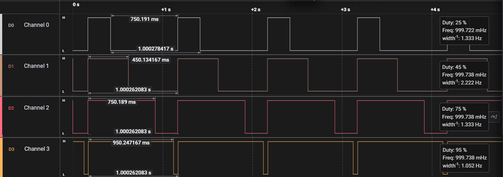

# 📊 STM32G0 TIM2 Multi-Channel PWM & Hardware Verification

This project demonstrates the configuration of **TIM2 (a 32-bit General-Purpose Timer)** on the **STM32G0** microcontroller to generate synchronized hardware PWM signals across 4 channels. The implementation features a 1-second period with precise duty cycles, running fully on dedicated hardware with **0% CPU overhead** (no interrupts or polling routines are used in runtime).

The accuracy of the output signals is validated using a digital Logic Analyzer, with the results documented below.

---

## 🛠️ System Architecture & Theory

### 1. Clock Configuration (`SYSCLK = 64 MHz`)
The microcontroller is configured to run at its maximum stable internal frequency of **64 MHz** using the High-Speed Internal (HSI) oscillator as the PLL source:
* **Internal Oscillator (HSI):** 16 MHz
* **PLL Configuration:** Multiplied and divided to reach exactly **64 MHz** (`SYSCLK`)
* **Timer Frequency:** Since the APB1 clock prescaler is set to `/1`, `TIM2` receives the full 64 MHz clock directly.

### 2. Time-Base Calculation
Unlike 16-bit timers that require aggressive prescaling to achieve low-frequency periods, `TIM2` is a **32-bit timer**. This allows us to maintain maximum resolution (sampling at 64 MHz) while achieving a long period of exactly **1 second**:

$$\text{Target Period} = 1.0 \text{ second}$$
$$\text{Ticks} = \text{Timer Clock} \times \text{Target Period} = 64,000,000 \text{ ticks}$$
$$\text{ARR (Auto-Reload Register)} = \text{Ticks} - 1 = 63,999,999$$

By setting `Prescaler = 0`, the counter increments every $15.625 \text{ ns}$ ($1 / 64\text{MHz}$), providing unrivaled duty-cycle granularity.

### 3. PWM Channels & Duty Cycle Mapping
The four independent channels are mapped to specific hardware pins and programmed with distinct duty cycles via their respective Capture/Compare Registers (`CCR1` to `CCR4`):

| Timer Channel | Hardware Pin | Target Duty Cycle | Pulse Calculation ($\text{ARR} \times \text{Duty Percentage}$) | Actual Register Value (`Pulse`) |
| :--- | :--- | :---: | :--- | :---: |
| **Channel 1** | `PA0` | **25%** | $64,000,000 \times 0.25$ | `16000000` |
| **Channel 2** | `PA1` | **45%** | $64,000,000 \times 0.45$ | `28800000` |
| **Channel 3** | `PB10` | **75%** | $64,000,000 \times 0.75$ | `48000000` |
| **Channel 4** | `PB11` | **95%** | $64,000,000 \times 0.95$ | `60800000` |

---

## 📊 Hardware Verification (Logic Analyzer Capture)

The generated signals were probed using a digital logic analyzer at a sampling rate of **12 MS/s** over a duration of 5 seconds to verify signal timings.

### Waveform Analysis:
* **Synchronized Alignment:** All 4 channels transition to `HIGH` at precisely the exact same moment, signaling the start of a new timer period.
* **Period Timing ($T = 1.0002\text{ s}$):** The markers confirm an incredibly stable period of exactly 1 second, matching our $1\text{ Hz}$ frequency requirement.
* **Duty Cycle Breakdown:**
  * **Channel 0 (`PA0`):** Stays `HIGH` for exactly **$250.19\text{ ms}$** ($\approx 25\%$) and falls to `LOW` for the remaining $750\text{ ms}$.
  * **Channel 1 (`PA1`):** Stays `HIGH` for exactly **$450.13\text{ ms}$** ($\approx 45\%$).
  * **Channel 2 (`PB10`):** Stays `HIGH` for exactly **$750.18\text{ ms}$** ($\approx 75\%$).
  * **Channel 3 (`PB11`):** Stays `HIGH` for virtually the entire cycle, falling to `LOW` for only **$50.24\text{ ms}$** at the very edge ($\approx 95\%$).

---

## 📂 Project Structure

* `Core/Src/main.c`: Contains the main application lifecycle, high-speed PLL clock setup (`SystemClock_PLL_64MHz_Config`), and the `TIM2` PWM baseline initialization.
* `Core/Src/stm32g0xx_hal_msp.c`: Configures low-level hardware resources (enables peripheral clocks for GPIOA, GPIOB, and TIM2, and sets up alternate function multiplexing for the pins).
* `docs/images/pwm_waveforms_capture.png`: High-resolution logic analyzer capture displaying verified physical waveforms.

---

## 🚀 Key Takeaways & Embedded Insights

1. **Hardware-Driven Execution:** Once `HAL_TIM_PWM_Start()` is called, the STM32 hardware handles the pin toggling and timing purely in the background. The main execution loop `while(1)` remains entirely empty, keeping the CPU free for other low-level tasks or low-power sleep modes.
2. **32-bit Timer Advantages:** Using a 32-bit timer (`TIM2`) bypasses the traditional trade-off between clock speed and period length. We successfully generated a very slow $1\text{ Hz}$ wave while preserving the nanosecond-level resolution of a raw $64\text{ MHz}$ clock.